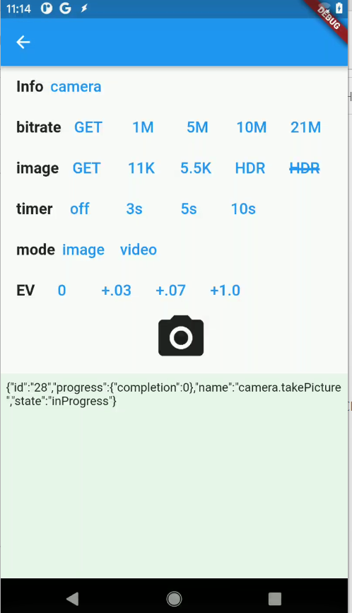

# Bitrate Image Tester



## bitrate

THETA X, 11K, HDR

| bitrate | filesize |
| ------- | -------- |
| 1,048,576 |  4.956MB |
| 5,242,880 | 6.594MB |
| 10,485,760 | 10.472MB |
| 20971520 | 21.047MB |

Example of setting options on the RICOH THETA 360 camera using the open source SDK
[theta-client](https://github.com/ricohapi/theta-client).

This is a modification of the theta-client demo for Flutter.

## Functions

* List photos in Theta.
* View sphere photo in Theta.
* Take a photo with Theta.
* Capture video with Theta.

## building and execution

```text
flutter pub get
flutter run
```
