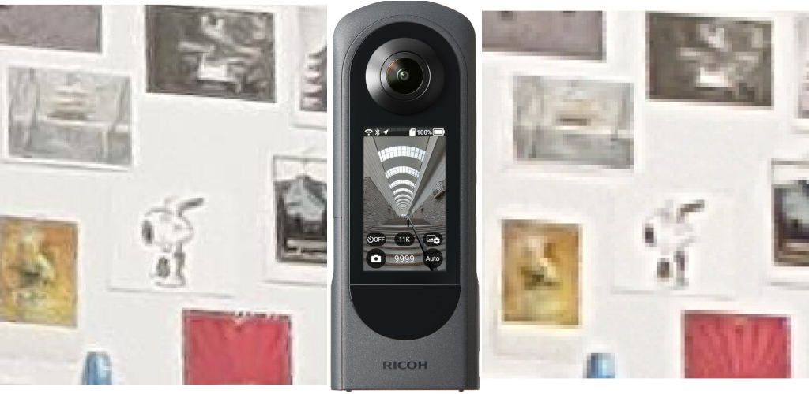
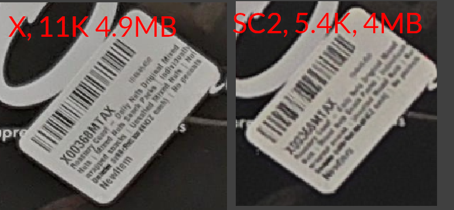
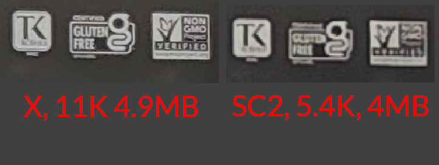
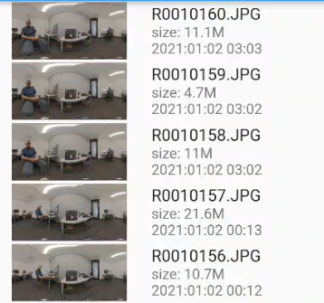
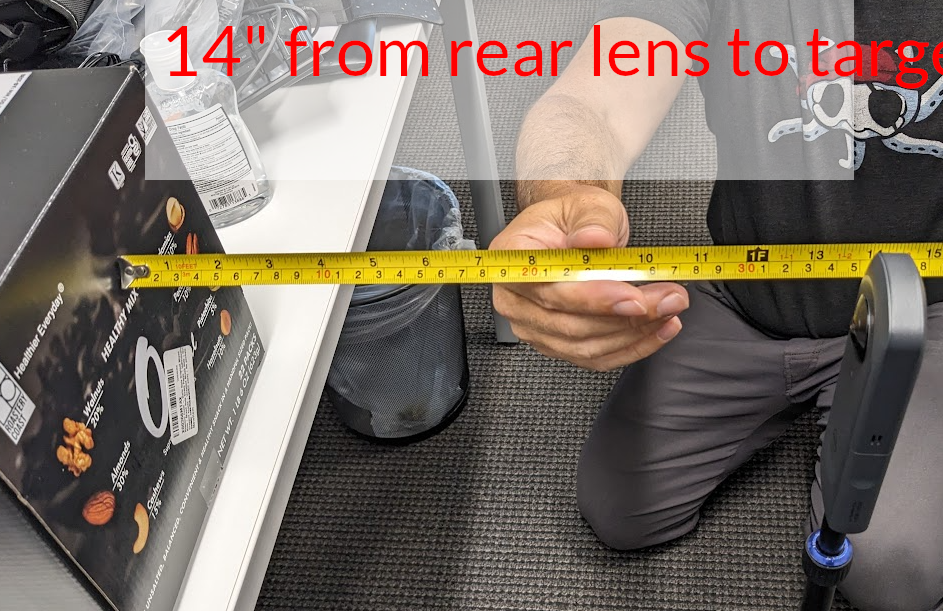
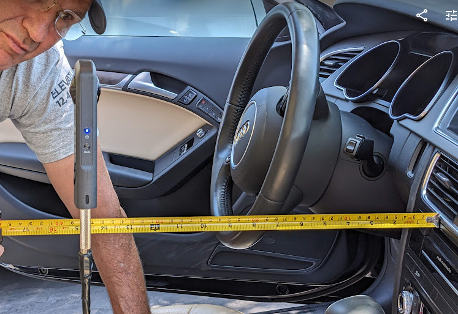
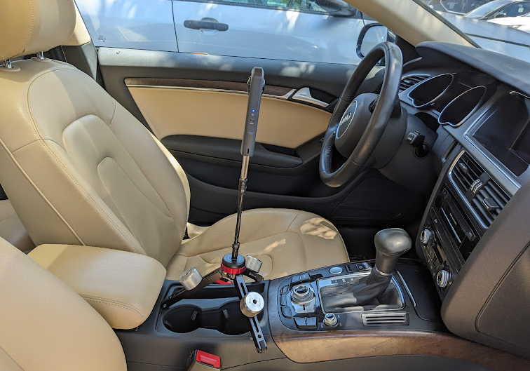
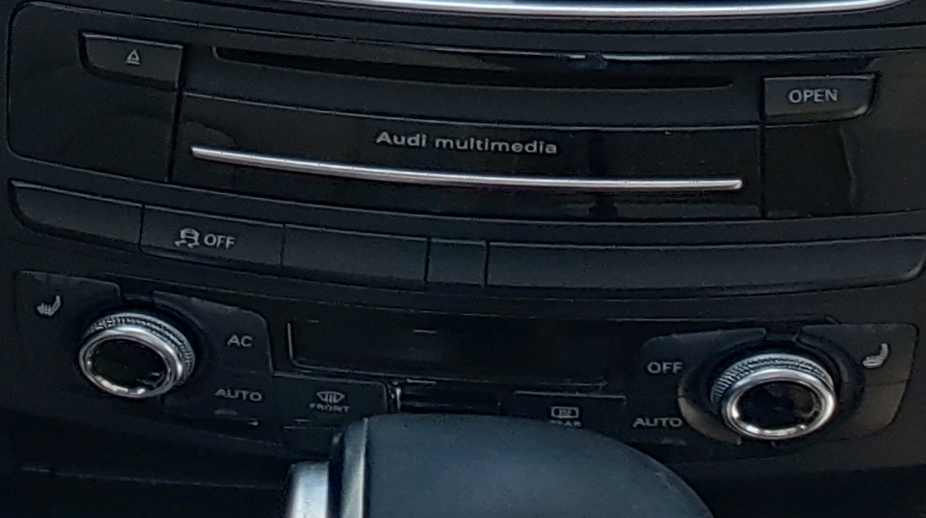
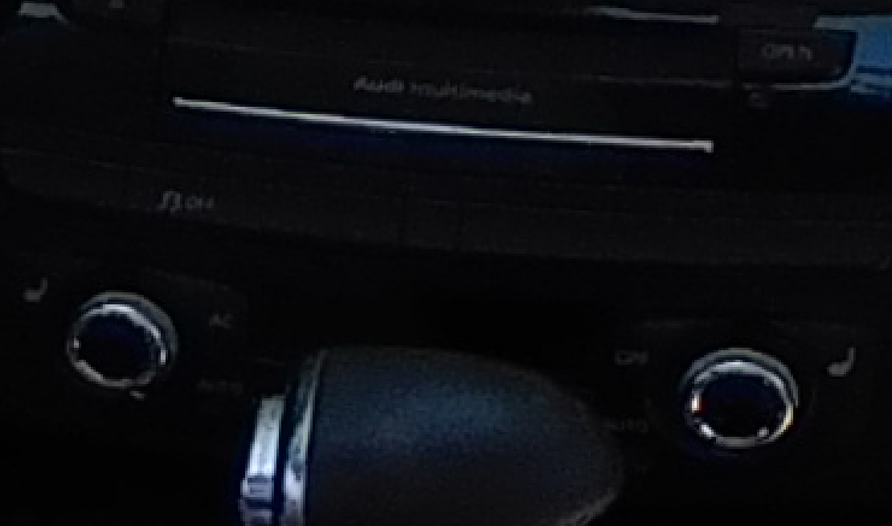

# Bitrate Image Tester




## balancing file size and image clarity





## bitrate

THETA X, 11K, HDR

| bitrate | filesize |
| ------- | -------- |
| 1,048,576 |  4.956MB |
| 5,242,880 | 6.594MB |
| 10,485,760 | 10.472MB |
| 20,971,520 | 21.047MB |

## file listing with file size



## 360 image navigation


## setup



## theta-client

Example of setting options on the RICOH THETA 360 camera using the open source SDK
[theta-client](https://github.com/ricohapi/theta-client).

This is a modification of the theta-client demo for Flutter.

## Functions

* List photos in Theta.
* View sphere photo in Theta.
* Take a photo with Theta.
* Capture video with Theta.

## building and execution

```text
flutter pub get
flutter run
```

## Use in Automotive Sales





### THETA X

The X benefits from better HDR processing as well as higher resolution.



### SC2

We can likely take a better shot from the SC2.  The lighting was difficult as sun was
coming in from the window.



### Full size images from car interior (can be downloaded for close inspection)

THETA X, 11K, HDR

| bitrate - no HDR | filesize |  |
| ------- | -------- | -------- |
| 1,048,576 |  6MB | |
| 5,242,880 | 7.2MB | |
| 10,485,760 | 11.2MB | |
| 20,971,520 | 19.5MB | |

| bitrate - HDR | filesize |  |
| ------- | -------- | -------- |
| 1,048,576 |  4.9MB | |
| 5,242,880 | 6.6MB | |
| 10,485,760 | 11.4MB | |
| 20,971,520 | 21.4MB | |

SC2, 5.7K, no HDR

| filesize | |
| ------- | ------- | 
|  4.2MB | |

SC2, 5.7K, HDR

| filesize | |
| ------- | ------- | 
|  4.2MB | |


## file listing with file size


## build information

```text
java --version
openjdk 19.0.2 2023-01-17
OpenJDK Runtime Environment (build 19.0.2+7-Ubuntu-0ubuntu322.04)
OpenJDK 64-Bit Server VM (build 19.0.2+7-Ubuntu-0ubuntu322.04, mixed mode, sharing)

echo $JAVA_HOME
/usr/lib/jvm/java-19-openjdk-amd64

```
